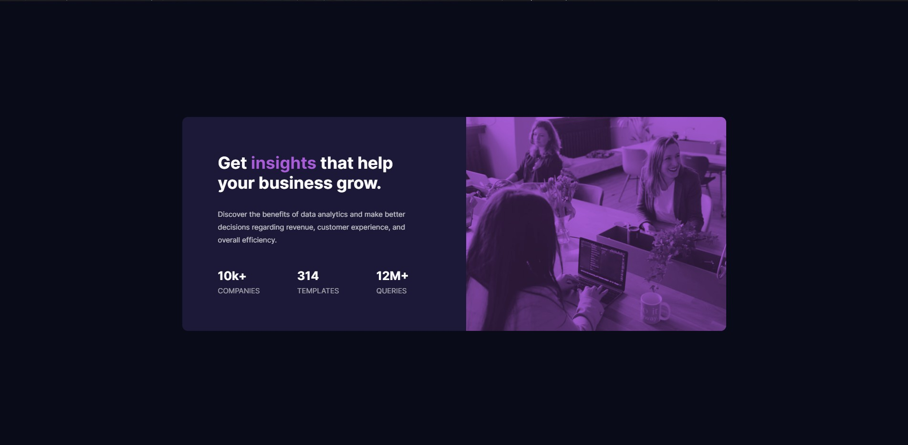

# Frontend Mentor - Stats preview card component solution

This is a solution to the [Stats preview card component challenge on Frontend Mentor](https://www.frontendmentor.io/challenges/stats-preview-card-component-8JqbgoU62). Frontend Mentor challenges help you improve your coding skills by building realistic projects. 

## Table of contents

- [Overview](#overview)
  - [The challenge](#the-challenge)
  - [Screenshot](#screenshot)
  - [Links](#links)
- [My process](#my-process)
  - [Built with](#built-with)
  - [What I learned](#what-i-learned)
  - [Continued development](#continued-development)
  - [Useful resources](#useful-resources)
- [Author](#author)

## Overview

### The challenge

Users should be able to:

- View the optimal layout depending on their device's screen size

### Screenshot

### Links

- Solution URL: [Github repo](https://github.com/deavenrivaldi/stats_preview_card_challenge)
- Live Site URL: [Website](https://deavenrivaldi.github.io/stats_preview_card_challenge/)

## My process

### Built with

- Semantic HTML5 markup
- CSS custom properties
- Flexbox
- Desktop-first workflow
- Media query

### What I learned

In this challenge I try to implement all the html structures and css styling I've learnt from the previous challenges. In this challenge, I feel that I'm starting to get the hang of creating the HTML structure so I felt that it's not as hard as the previous challenges. 

There are some new things that I learned from this challenge, especially for the css styling. First I learn about the mix-blend-mode to give color to the image. At first, I tried to give color using the overlay method I learnt from the previous challenge, but the result is not very satisfying. That's when I try to look up for a solution video and found the mix-blend-mode to give the color. 

From another solution video, I also learnt that I can make columns for the card using grid, but I found it more comfortable to just use the usual flex-box method, so in the end, my solution didn't use any grid. 

The rest of the styling are everything I've learnt from the previous challenges and they are still all based on feeling, but I'm glad that the end result is quite satisfying.

### Continued development

The website is still unresponsive. I made just 1 media query to fit the mobile-size so for the next development, maybe I can try to make the web more responsive and adaptive to the resolution changes.

### Useful resources

- [w3schools](https://www.w3schools.com/) - w3schools has always been the first website I look up to when I want to know more about the css styling I'm about to use.
- [Solution video](https://www.youtube.com/watch?v=zaHdmJf_ld4) - some parts of my solution are inspired from this video.

## Author

- Website - [Website](https://deavenrivaldi.github.io/first-website/)
- Frontend Mentor - [@deavenrivaldi](https://www.frontendmentor.io/profile/deavenrivaldi)
- Linkedin - [Deaven Rivaldi](https://www.linkedin.com/in/deavenrivaldi/)
